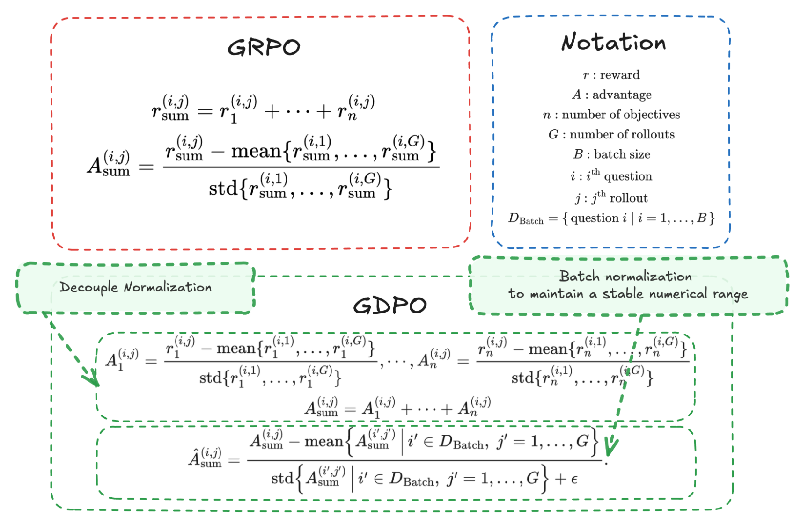

# GDPO: Group reward-Decoupled Normalization Policy Optimization for Multi-reward RL Optimization
<h1 align="center"> 
    
</h1>

<p align="center">
        🤗 <a href="">Hugging Face Paper</a>&nbsp&nbsp | &nbsp&nbsp 📄 <a href="">Paper</a> | &nbsp&nbsp 📜 <a href="">Page</a> &nbsp
</p>

## Introduction

GDPO is a reinforcement learning optimization method designed for multi-reward training. While existing approaches commonly apply Group Relative Policy Optimization (GRPO) in multi-reward settings, we show that this leads to reward advantages collapse, reducing training signal resolution and causing unstable or failed convergence.

GDPO resolves this issue by decoupling reward normalization across individual rewards, preserving their relative differences and enabling more faithful preference optimization. Across tool calling, math reasoning, and code generation tasks, GDPO consistently surpasses GRPO in both training convergence and downstream evaluation performance.

In this repo, we provide implementation of GDPO based on [VERL](https://github.com/volcengine/verl) at [verl-GDPO](./verl-GDPO), [TRL](https://github.com/huggingface/trl) at [trl-GDPO](./trl-GDPO/), and [Nemo-RL](https://github.com/NVIDIA-NeMo/RL) at [nemo_rl-GDPO](./nemo_rl-GDPO/). 

We also include easy-to-use, slurm-free training scripts that enable the community to quickly validate GDPO’s effectiveness over GRPO on tool calling and math reasoning tasks. Each run can be completed in approximately 1 hour on a single node with 8×A100 GPUs, or around 2.5 hours on a single A100 GPU.

## Quick Verification of the effectiveness of GDPO on improving two-reward RL training (Tool Calling)
<h1 align="center"> 
    
</h1>

Here we compare GDPO with GRPO on the tool calling task, specifically, the model trained to learn how to incorporate external tools into the reasoning trajectory to solve a user task following the output format of
```
**Output Format**
<think> Your thoughts and reasoning </think>
<tool_call>
{json_string}
...
</tool_call>
<response> AI's final response </response>
```
The training set consists of 4k samples. Each training instance contains a question and its corresponding ground-truth tool calls. The training involves two rewards:

* Format Reward: A binary reward (0 or 1) checks whether the model output satisfies the required structure and contains all necessary fields in the correct order.
* Correctness Reward: The correctness reward ∈ [−3, 3] evaluates the model-generated tool calls against the ground-truth calls using three metrics: tool name matching, parameter name matching, and parameter content matching.

We train Qwen2.5-1.5B-Instruct with GDPO and GRPO using verl for 100 steps. Check [verl-GDPO](./verl-GDPO) for detailed implementation of GDPO based on VERL and how to reprodcue the above result.


## Quick Verification of the effectiveness of GDPO on improving three-reward RL training (Math Reasoning)
<h1 align="center"> 
    
</h1>

We compare GDPO and GRPO in their ability to incentivize the model’s reasoning capabilities (i.e., achieving the “aha” moment). Specifically, the model is trained to first produce detailed reasoning steps and then output the final answer in a prescribed format when solving user queries.
```
Output Format:
<think>Your thoughts and reasoning</think>
<answer>Final answer in integer format</answer>
```
Training is conducted on the GSM8K dataset, where each example consists of a math problem paired with its ground-truth answer. The RL training incorporates three reward signals:

* Format Reward: A binary reward (0 or 1) indicating whether the model output follows the required structure and includes all necessary tags in the correct order.

* Correctness Reward: A binary reward (0 or 1) that verifies whether the final answer enclosed within `<answer></answer>` matches the ground-truth solution.

* Integer Reward: A binary reward (0 or 1) that checks whether the final answer inside `<answer></answer>` is an integer, encouraging integer-only outputs.

We train Qwen2.5-1.5B-Instruct with GDPO and GRPO using trl for 1 epoch. Check [trl-GDPO](./trl-GDPO) for detailed implementation of GDPO based on TRL and how to reprodcue the above result.


## Citation
If you find GDPO useful, please star and cite it:
```bibtex

```

## Licenses
Copyright © 2026, NVIDIA Corporation. All rights reserved.

This work is made available under the NVIDIA Source Code License-NC. Click [here](https://github.com/NVlabs/GDPO/blob/main/LICENSE) to view a copy of this license.