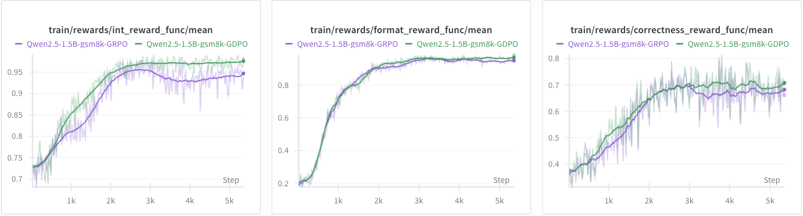

# GDPO vs. GRPO on math RL training (GDPO Implementation based on trl)


<h1 align="center"> 
    
</h1>


## Installation
Please install vLLM and FlashAttention first, then install open-r1
```
pip install vllm==0.8.5.post1
pip install setuptools
pip install flash-attn --no-build-isolation
cd open-r1
pip install -e ".[dev]"
```
Then install trl (GDPO Implementation based on trl version 0.18.0)
```
cd trl-0.18.0-gdpo
pip install -e .
```

## Dataset
Dataset will be automatically downloaded from https://huggingface.co/datasets/openai/gsm8k

## Training
Before starting, configure your API keys and Hugging Face cache path:
```
export WANDB_API_KEY="Your API KEY"
export HF_TOKEN="Your API KEY"
export HF_HOME="YOU HF CACHE ADDRESS"
```
For GRPO and GDPO training, please specify the configuration in GDPO/trl-GDPO/open-r1/recipes/Qwen2.5-1.5B-Instruct/gdpo_gsm8k/config.yaml and GDPO/trl-GDPO/open-r1/recipes/Qwen2.5-1.5B-Instruct/grpo_gsm8k/config.yaml
```
cd GDPO/trl-GDPO/open-r1
bash run_gsm8k_gdpo.sh # For GDPO Training
bash run_gsm8k_grpo.sh # For GRPO Training
```
FYI. training Qwen2.5-1.5B-Instruct on a single Node with 8xA100 takes about an hour to finish.


## GDPO Implementation details
Please see line 1222 in trl-0.18.0-gdpo/trl/trainer/grpo_trainer.py