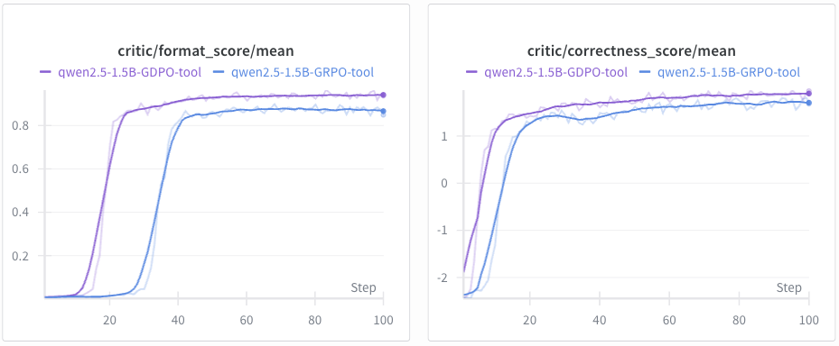

# GDPO vs. GRPO on tool calling RL training (GDPO Implementation based on verl)

<h1 align="center"> 
    
</h1>

## Installation
Please install torch, vllm and ray according to your own environment configuration.
```
# install torch
pip install torch==2.4.0 --index-url https://download.pytorch.org/whl/cu121
# install vllm
pip install vllm==0.6.3
pip install ray
```

Please further install the verl in the current project and flash attention.
```
# verl
cd verl
pip install -e .

# flash attention 2
pip install flash-attn --no-build-isolation
```

## Dataset 
Please first clone the ToolRL repo then copy the data to this folder
```
git clone git@github.com:qiancheng0/ToolRL.git
cp -r ToolRL/dataset verl-GDPO/
```

## Training
Before starting, configure your API keys and Hugging Face cache path:
```
export WANDB_API_KEY="Your API KEY"
export HF_TOKEN="Your API KEY"
export HF_HOME="YOU HF CACHE ADDRESS"
```
For GRPO and GDPO training, please specify the configuration in train_gdpo.sh and train_grpo.sh
```
bash train_gdpo.sh # For GDPO Training
bash train_grpo.sh # For GRPO Training
```
FYI. training Qwen2.5-1.5B-Instruct on a single Node with 8xA100 takes about an hour to finish.


## GDPO Implementation details
Please see [line 175](https://github.com/NVlabs/GDPO/blob/8bc7a4f5107eedb3e0ca653c53bd4bb8b71460c3/verl-GDPO/verl/trainer/ppo/ray_trainer.py#L175) in verl-GDPO/verl/trainer/ppo/ray_trainer.py
